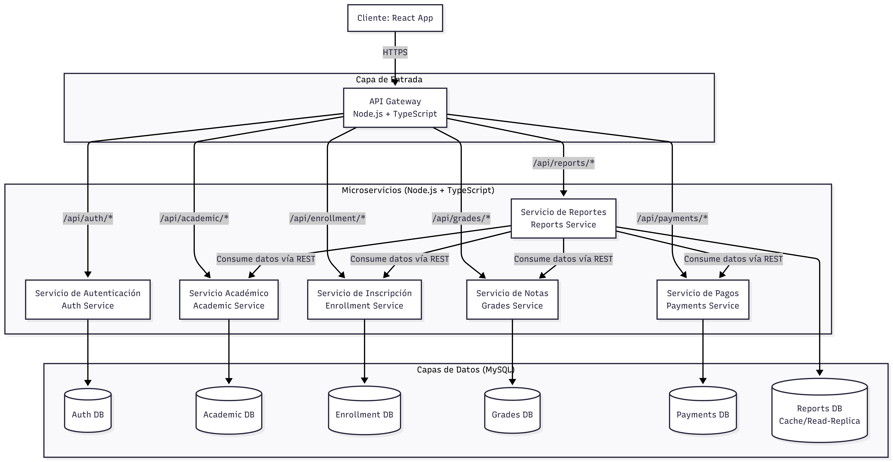

# SysCademy - Sistema de Gestión Escolar

La creciente complejidad en la administración educativa exige soluciones tecnológicas robustas, escalables y adaptables. El presente proyecto consiste en el desarrollo de un Sistema de Gestión Escolar Integral, diseñado para optimizar los flujos de trabajo administrativos y académicos de las instituciones educativas. Para garantizar la independencia y evolución continua de sus funcionalidades, el sistema se estructura bajo una **arquitectura de microservicios**, desacoplando los seis módulos nucleares que rigen el ciclo académico: **Inscripciones, Pagos, Asignación de Grado, Gestión de Notas, Gestión de Cursos y Generación de Reportes**. Técnicamente, la solución se apoya en un backend basado en Node.js y TypeScript, lo que asegura alta concurrencia y tipado estático para reducir errores en tiempo de ejecución, mientras que el frontend desarrollado en React proporciona una interfaz dinámica, responsiva y de fácil interacción para los usuarios finales.

## Documentación de Requerimientos

### 1. Requerimientos Funcionales

#### Módulo de Autenticación y Roles
- **RF‑01**: El sistema debe permitir el inicio de sesión mediante correo electrónico y contraseña.
- **RF‑02**: El login debe validar el rol del usuario (Administración, Docente, Alumno, Padre de familia) y redirigir a su panel correspondiente.
- **RF‑03**: Los usuarios con rol **Administración** pueden crear, editar y deshabilitar cuentas de docentes, alumnos y padres.
- **RF‑04**: Los usuarios pueden recuperar su contraseña mediante un enlace enviado al correo registrado.

#### Módulo de Gestión Académica (Grados y Asignaturas)
- **RF‑05**: El sistema debe permitir la creación, edición y eliminación de **niveles** (Primaria, Básicos, Diversificado).
- **RF‑06**: Cada nivel puede contener varios **grados** (ej. 1º Primaria, 2º Básico, etc.).
- **RF‑07**: Cada grado puede tener asignaturas personalizables; el **administrador** puede agregar, modificar o eliminar asignaturas en cualquier momento.
- **RF‑08**: Las asignaturas se asocian a un grado específico y no pueden ser compartidas entre grados a menos que se configuren explícitamente.

#### Módulo de Inscripción de Alumnos
- **RF‑09**: El sistema permite inscribir un nuevo alumno registrando sus datos personales (nombre, apellido, fecha de nacimiento, CUI, dirección, teléfono, correo, etc.).
- **RF‑10**: Durante la inscripción, se debe asignar el alumno a un grado específico (de cualquier nivel).
- **RF‑11**: Es posible reasignar un alumno a otro grado en cualquier momento (cambio de grado), manteniendo el historial de notas y pagos.
- **RF‑12**: Cada alumno tiene un expediente que agrupa toda su información académica y financiera.

#### Módulo de Gestión de Notas y Actividades
- **RF‑13**: El sistema divide el año lectivo en **4 bimestres**.
- **RF‑14**: Para cada bimestre, el docente puede crear **actividades** (tareas, exámenes, proyectos, etc.) dentro de cada asignatura.
- **RF‑15**: Cada actividad tiene un nombre, descripción, fecha de entrega, porcentaje de ponderación y puntaje máximo.
- **RF‑16**: El docente puede registrar la nota obtenida por cada alumno en cada actividad, por bimestre.
- **RF‑17**: El sistema calcula automáticamente la nota final del bimestre para cada asignatura, según la ponderación de las actividades.
- **RF‑18**: Al finalizar los 4 bimestres, el sistema calcula el promedio final de cada asignatura (suma de notas bimestrales / 4) y lo muestra en la boleta.
- **RF‑19**: El sistema permite visualizar y exportar la boleta de notas de un alumno (PDF o impresión).

#### Módulo de Gestión de Pagos
- **RF‑20**: El sistema permite registrar pagos de matrícula, mensualidades y otros conceptos asociados a un alumno.
- **RF‑21**: Se puede consultar el historial de pagos de cada alumno, con fechas, montos y estados (pagado, pendiente, vencido).
- **RF‑22**: El sistema genera un recibo de pago en formato PDF para cada transacción.
- **RF‑23**: El administrador puede configurar conceptos de pago (matrícula, pensión, materiales, etc.) y sus montos por grado o nivel.

#### Módulo de Reportes Estadísticos
- **RF‑24**: El sistema genera reportes de rendimiento académico (promedios por grado, asignatura, bimestre).
- **RF‑25**: Se pueden filtrar reportes por nivel, grado, asignatura, bimestre o rango de fechas.
- **RF‑26**: Los reportes se pueden exportar en formato PDF.
- **RF‑27**: El sistema muestra dashboards con gráficos (barras, líneas, pastel) para visualizar tendencias de notas, asistencia (si se implementa) y pagos.

#### Módulo de Roles y Vistas Personalizadas
- **RF‑28**: **Administración**: acceso total a todos los módulos (gestión de usuarios, académico, inscripciones, pagos, reportes).
- **RF‑29**: **Docente**: puede ver los alumnos de sus grados/asignaturas, registrar notas y actividades, ver reportes de su clase.
- **RF‑30**: **Alumno**: puede ver su propio expediente, notas por bimestre, boleta final y su historial de pagos (solo lectura).
- **RF‑31**: **Padre de familia**: puede ver la información de sus hijos (notas, boletas, pagos) pero no puede modificarla.

---

### 2. Requerimientos No Funcionales

- **RNF‑01 (Rendimiento)**: El sistema debe responder a las solicitudes en menos de 2 segundos en condiciones normales de carga (hasta 1000 usuarios concurrentes).
- **RNF‑02 (Escalabilidad)**: La arquitectura de microservicios debe permitir escalar horizontalmente los servicios más demandados (autenticación, académico, pagos).
- **RNF‑03 (Disponibilidad)**: El sistema debe tener una disponibilidad del 99.5% en horario escolar (7:00 am – 6:00 pm) y 98% fuera de ese horario.
- **RNF‑04 (Seguridad)**: Todas las comunicaciones deben estar cifradas mediante HTTPS. Las contraseñas se almacenan con hash (bcrypt) y se usa JWT con expiración corta (15 minutos) y refresh tokens.
- **RNF‑05 (Integridad de datos)**: Se deben implementar transacciones ACID en operaciones críticas (inscripción, registro de notas, pagos).
- **RNF‑06 (Respaldo)**: Se realizarán copias de seguridad automáticas de la base de datos cada 6 horas, con retención de 30 días.
- **RNF‑07 (Tecnologías)**: Backend con Node.js + TypeScript, Frontend con React, bases de datos relacionales (MySQL) por microservicio, Docker, Kubernetes, CI/CD con GitHub Actions.
- **RNF‑08 (Logging y monitoreo)**: Todos los microservicios deben generar logs estructurados (JSON) y contar con métricas (Prometheus) y alertas (Grafana).
- **RNF‑09 (Mantenibilidad)**: El código debe seguir estándares ESLint/Prettier y tener una cobertura de pruebas unitarias e integración superior al 80%.
- **RNF‑10 (Usabilidad)**: La interfaz debe ser responsiva y accesible (WCAG 2.1 nivel AA), con mensajes de error claros y ayuda contextual.

---

### 3. Historias de Usuario

#### Administración
| ID   | Como...       | Quiero...                                                                 | Para...                                 |
|------|---------------|---------------------------------------------------------------------------|------------------------------------------|
| HU‑01| Administrador | gestionar (crear, editar, deshabilitar) cuentas de docentes, alumnos y padres | mantener el control de acceso al sistema |
| HU‑02| Administrador | configurar niveles, grados y asignaturas                                 | adaptar la oferta académica cada año     |
| HU‑03| Administrador | inscribir alumnos y asignarlos a un grado                                | mantener el registro de estudiantes      |
| HU‑04| Administrador | registrar pagos y generar recibos                                        | llevar un control financiero claro       |
| HU‑05| Administrador | visualizar reportes estadísticos de rendimiento y pagos                  | tomar decisiones basadas en datos        |
| HU‑06| Administrador | generar la boleta de notas de cualquier alumno                           | entregar documentos oficiales            |

#### Docente
| ID   | Como... | Quiero...                                                                 | Para...                                  |
|-------|---------|---------------------------------------------------------------------------|-------------------------------------------|
| HU‑07| Docente | ver la lista de alumnos de mis grados/asignaturas                        | conocer a mis estudiantes                 |
| HU‑08| Docente | crear actividades y ponderarlas por bimestre                             | planificar la evaluación                  |
| HU‑09| Docente | registrar las notas de cada alumno en cada actividad                     | calificar el desempeño                    |
| HU‑10| Docente | consultar el promedio bimestral y final de cada alumno                   | hacer seguimiento académico               |
| HU‑11| Docente | exportar reportes de mi clase (notas, promedios)                         | compartir información con coordinación    |

#### Alumno
| ID   | Como... | Quiero...                                                                 | Para...                                  |
|-------|---------|---------------------------------------------------------------------------|-------------------------------------------|
| HU‑12| Alumno  | ver mi expediente académico (datos personales, grado)                    | conocer mi situación actual               |
| HU‑13| Alumno  | consultar mis notas por bimestre y asignatura                           | saber mi rendimiento en cada materia      |
| HU‑14| Alumno  | ver mi boleta final con el promedio de cada asignatura                  | tener mi historial académico              |
| HU‑15| Alumno  | revisar mi historial de pagos                                           | llevar control de mis obligaciones        |

#### Padre de Familia
| ID   | Como...       | Quiero...                                                                 | Para...                                  |
|------|---------------|---------------------------------------------------------------------------|-------------------------------------------|
| HU‑16| Padre         | ver la información académica de mis hijos (notas, boletas)              | dar seguimiento a su educación            |
| HU‑17| Padre         | consultar el historial de pagos de mis hijos                            | gestionar los gastos escolares            |
| HU‑18| Padre         | recibir notificaciones (por correo) sobre bajas notas o pagos vencidos  | actuar a tiempo                           |

---

### 4. Casos de Uso

#### CU‑01: Iniciar sesión
- **Actor**: Administrador, Docente, Alumno, Padre  
- **Descripción**: El usuario ingresa su correo y contraseña para acceder al sistema.  
- **Flujo básico**:
  1. El usuario introduce credenciales.
  2. El sistema valida la existencia del usuario y la contraseña.
  3. El sistema genera un token JWT y lo envía al frontend.
  4. El usuario es redirigido a su panel según su rol.
- **Flujos alternativos**:
  - Credenciales incorrectas → mensaje de error.
  - Cuenta deshabilitada → mensaje de acceso denegado.

#### CU‑02: Gestionar usuarios (Administración)
- **Actor**: Administración  
- **Descripción**: Crear, editar o deshabilitar cuentas de docentes, alumnos y padres.  
- **Flujo básico**:
  1. El administrador selecciona "Usuarios".
  2. Elige la opción "Nuevo usuario", llena el formulario y asigna rol.
  3. El sistema guarda los datos y envía un correo con las credenciales temporales.
- **Flujos alternativos**:
  - Editar: modifica datos y guarda cambios.
  - Deshabilitar: cambia el estado a inactivo, impidiendo el acceso.

#### CU‑03: Configurar grados y asignaturas (Administración)
- **Actor**: Administración  
- **Descripción**: Crear niveles, grados y asignar asignaturas a cada grado.  
- **Flujo básico**:
  1. El administrador va a "Configuración académica".
  2. Agrega un nivel (ej. Primaria) y luego grados dentro de él.
  3. Para cada grado, agrega asignaturas con nombre y código.
  4. El sistema persiste la estructura.

#### CU‑04: Inscribir alumno
- **Actor**: Administración  
- **Descripción**: Registrar un nuevo alumno y asignarlo a un grado.  
- **Flujo básico**:
  1. El administrador selecciona "Inscripciones" → "Nuevo alumno".
  2. Completa los datos personales y elige el grado.
  3. El sistema crea el expediente del alumno y lo asocia al grado.
- **Flujos alternativos**:
  - Cambio de grado: se reasigna sin perder el historial.

#### CU‑05: Registrar actividades y notas (Docente)
- **Actor**: Docente  
- **Descripción**: Crear actividades para una asignatura/bimestre y calificar a los alumnos.  
- **Flujo básico**:
  1. El docente elige su asignatura y bimestre.
  2. Crea una actividad (nombre, fecha, ponderación, puntaje máximo).
  3. Luego ingresa las notas para cada alumno (o las importa desde un archivo).
  4. El sistema calcula automáticamente el promedio del bimestre.
- **Flujos alternativos**:
  - Editar actividad o nota ya registrada.
  - Eliminar actividad (con confirmación).

#### CU‑06: Calcular promedio final
- **Actor**: Sistema (automático)  
- **Descripción**: Al finalizar los 4 bimestres, el sistema calcula el promedio de cada asignatura.  
- **Flujo básico**:
  1. El sistema toma las notas de los 4 bimestres.
  2. Calcula la media aritmética por asignatura y la almacena.
  3. La boleta final mostrará este promedio.

#### CU‑07: Generar boleta de notas
- **Actor**: Administración, Docente, Alumno, Padre (según permisos)  
- **Descripción**: Visualizar y exportar la boleta de notas de un alumno.  
- **Flujo básico**:
  1. El usuario selecciona al alumno.
  2. El sistema muestra la boleta con notas bimestrales y promedios.
  3. El usuario puede exportar a PDF.

#### CU‑08: Registrar pago
- **Actor**: Administración  
- **Descripción**: Ingresar un pago de un alumno por un concepto específico.  
- **Flujo básico**:
  1. El administrador busca al alumno.
  2. Selecciona "Registrar pago", elige concepto, monto y fecha.
  3. El sistema genera un recibo y actualiza el estado de cuenta.

#### CU‑09: Generar reportes estadísticos
- **Actor**: Administración, Docente  
- **Descripción**: Obtener reportes de rendimiento académico o financiero con filtros.  
- **Flujo básico**:
  1. El usuario entra a "Reportes".
  2. Selecciona el tipo (notas, pagos), aplica filtros (grado, bimestre, etc.).
  3. El sistema muestra tablas y gráficos; permite exportar.

#### CU‑10: Ver perfil y expediente (Alumno/Padre)
- **Actor**: Alumno, Padre  
- **Descripción**: Consultar datos personales, notas y pagos (solo lectura).  
- **Flujo básico**:
  1. El usuario accede a su panel.
  2. Visualiza la información sin posibilidad de modificarla.

---

## Documentación de Arquitectura

### 1. Diagrama de Microservicios
La arquitectura está orientada a dominios, donde cada microservicio es dueño de su propia lógica de negocio y base de datos. La comunicación entre el frontend y el backend se realiza a través de un **API Gateway** central (construido con Node.js y TypeScript), que actúa como punto único de entrada, maneja la autenticación (JWT), el rate limiting y el enrutamiento hacia los microservicios internos vía **REST**.



Descripción de los microservicios:

- API Gateway: Enruta las peticiones, valida el JWT, aplica políticas de CORS y limita la tasa de peticiones.

- Auth Service: Responsable del login, gestión de usuarios (CRUD) y roles.

- Academic Service: Administra la estructura educativa (niveles, grados, asignaturas).

- Enrollment Service: Gestiona el expediente de alumnos, inscripciones y cambios de grado.

- Grades Service: Administra bimestres, actividades, registro de notas y cálculo de promedios.

- Payments Service: Maneja conceptos de pago, transacciones y recibos.

- Reports Service: Orquesta la información de los demás servicios para generar estadísticas y boletas, almacenando datos agregados en su propia BD (o cache) para optimizar consultas pesadas.

-----

### 2. Modelo de Datos (MySQL)
Cada microservicio posee su propia base de datos MySQL. Para mantener la integridad referencial entre servicios, se utilizarán UUIDs como identificadores primarios (ej. ```user_id```, ```student_id```, ```grade_id```), de modo que cada servicio pueda referenciar entidades de otros servicios sin necesidad de llaves foráneas físicas.

#### Base de Datos: auth_db

| Tabla |	Descripción |	Campos clave |
| ------ | ------ | ----------------- | 
| users |	Usuarios del sistema	| id (UUID PK), email, password_hash, full_name, is_active, created_at |
| roles	| Catálogo de roles |	id (PK), name (ADMIN, TEACHER, STUDENT, PARENT) |
| user_roles |	Relación N:N entre usuarios y roles |	user_id (FK a users.id), role_id (FK a roles.id) |
| refresh_tokens |	Tokens para renovación de JWT |	id (PK), user_id (FK a users.id), token, expires_at, revoked |

#### Base de Datos: academic_db

| Tabla |	Descripción |	Campos clave |
| ----- | ----------- | ------------ |
| levels |	Niveles educativos (Primaria, Básicos, Diversificado) |	id (UUID PK), name, order_index, created_at |
| grades |	Grados pertenecientes a un nivel |	id (UUID PK), level_id (FK a levels.id), name (ej. "1ro Primaria"), academic_year |
| subjects |	Asignaturas asignadas a un grado |	id (UUID PK), grade_id (FK a grades.id), name, code, created_at |

#### Base de Datos: enrollment_db

| Tabla |	Descripción |	Campos clave |
| ----- | ----------- | ------------ |
| students |	Datos personales del alumno |	id (UUID PK), first_name, last_name, birth_date, dni, address, phone, email, guardian_name, guardian_phone |
| student_grade_history	| Historial de asignación de grados por alumno |	id (UUID PK), student_id (FK a students.id), grade_id (referencia a Academic Service), start_date, end_date (NULL si está activo) |

#### Base de Datos: grades_db

| Tabla |	Descripción |	Campos clave |
| ----- | ----------- | ------------ |
| bimesters |	Definición de bimestres por año lectivo |	id (UUID PK), name (Bimestre 1..4), academic_year, start_date, end_date, is_active |
| activities |	Actividades evaluadas por asignatura/bimestre |	id (UUID PK), subject_id (referencia a Academic Service), bimester_id (FK a bimesters.id), name, description, max_score, weight (porcentaje), due_date |
| activity_scores |	Notas de cada alumno por actividad |	id (UUID PK), activity_id (FK a activities.id), student_id (referencia a Enrollment Service), score (decimal), created_at, updated_at |
| final_averages |	Promedio final por alumno/asignatura (cálculo automático) |	id (UUID PK), student_id, subject_id, average_score (promedio de 4 bimestres), academic_year |

#### Base de Datos: payments_db

| Tabla |	Descripción |	Campos clave |
| ----- | ----------- | ------------ |
| payment_concepts |	Catálogo de conceptos de pago |	id (UUID PK), name (Matrícula, Pensión, etc.), amount, grade_id (opcional, referencia a Academic Service) |
| payments |	Registro de transacciones |	id (UUID PK), student_id (referencia a Enrollment Service), concept_id (FK a payment_concepts.id), amount, payment_date, due_date, status (PAGADO, PENDIENTE, VENCIDO), receipt_number (autogenerado), receipt_pdf_url |

#### Base de Datos: reports_db

| Tabla |	Descripción |	Campos clave |
| ----- | ----------- | ------------ |
| report_cache |	Almacena agregados para dashboards |	id (UUID PK), report_type (ACADEMIC, FINANCIAL), data (JSON), generated_at, filters (JSON) |

--------

### 3. Contratos de API (OpenAPI 3.0.0)
A continuación se definen los contratos mediante la especificación OpenAPI. El API Gateway expone todas las rutas con el prefijo ```/api/v1/```. Todas las rutas (excepto ```/auth/login``` y ```/auth/refresh```) requieren el header ```Authorization: Bearer <jwt_token>```.

#### Servicio de Autenticación (```/auth```)

```
openapi: 3.0.0
info:
  title: Auth Service API
  version: 1.0.0
servers:
  - url: https://api.example.com/api/v1/auth
paths:
  /login:
    post:
      summary: Iniciar sesión
      requestBody:
        required: true
        content:
          application/json:
            schema:
              type: object
              properties:
                email: { type: string }
                password: { type: string }
      responses:
        '200':
          description: OK
          content:
            application/json:
              schema:
                type: object
                properties:
                  access_token: { type: string }
                  refresh_token: { type: string }
                  user: 
                    type: object
                    properties:
                      id: { type: string }
                      email: { type: string }
                      full_name: { type: string }
                      roles: { type: array, items: { type: string } }
        '401': { description: Credenciales inválidas }
  /refresh:
    post:
      summary: Renovar JWT
      requestBody:
        content:
          application/json:
            schema:
              type: object
              properties:
                refresh_token: { type: string }
      responses:
        '200': { description: Nuevo access_token }
  /users:
    post:
      summary: Crear usuario (solo Administración)
      security: [{ BearerAuth: [] }]
      requestBody:
        content:
          application/json:
            schema:
              type: object
              properties:
                email: { type: string }
                password: { type: string }
                full_name: { type: string }
                roles: { type: array, items: { type: string } } # ADMIN, TEACHER, STUDENT, PARENT
      responses:
        '201': { description: Usuario creado }
```

#### Servicio Académico (```/academic```)


| Método |	Endpoint |	Descripción | Auth |
| ------ | --------- | ------------ | ---- |
| GET |	/levels |	Obtener todos los niveles |	Sí |
| POST | 	/levels |	Crear un nuevo nivel |	ADMIN |
| GET |	/levels/{id}/grades |	Obtener grados de un nivel |	Sí |
| POST | /grades |	Crear un grado |	ADMIN |
| GET	| /grades/{id}/subjects |	Obtener asignaturas de un grado |	Sí |
| POST |	/subjects |	Agregar asignatura a un grado |	ADMIN |
| PUT |	/subjects/{id} |	Editar asignatura |	ADMIN |
| DELETE | /subjects/{id} |	Eliminar asignatura |	ADMIN |

#### Servicio de Inscripción (```/enrollment```)

| Método |	Endpoint |	Descripción |	Auth |
| ------ | --------- | ------------ | ---- |
| POST | /students | Inscribir un nuevo alumno | ADMIN |
| GET |	/students/{id} |	Obtener datos del alumno |	ADMIN/TEACHER/STUDENT/PARENT* |
| PUT |	/students/{id} |	Actualizar datos del alumno |	ADMIN |
| POST |	/students/{id}/change-grade |	Cambiar de grado (crea un registro en history) |	ADMIN |
| GET |	/students/{id}/history |	Ver historial de grados del alumno | ADMIN/TEACHER |
| GET	| /grades/{id}/students |	Listar alumnos de un grado específico |	ADMIN/TEACHER |

*Los padres solo ven a sus hijos asociados; los alumnos solo ven su propio perfil.

#### Servicio de Notas (```/grades```)

| Método |	Endpoint |	Descripción |	Auth |
| ------ | --------- | ------------ | ---- |
| GET |	/bimesters/current |	Obtener bimestre activo actual |	Sí |
| POST |	/bimesters |	Crear un bimestre (configuración año) |	ADMIN |
| POST |	/activities |	Crear actividad en una asignatura/bimestre |	TEACHER |
| GET |	/activities/{id} |	Obtener detalles de una actividad |	TEACHER/ADMIN |
| PUT |	/activities/{id} |	Editar actividad |	TEACHER |
| DELETE | /activities/{id} |	Eliminar actividad |	TEACHER |
| POST |	/scores |	Registrar/actualizar nota de un alumno en una actividad |	TEACHER |
| GET |	/students/{studentId}/bimesters/{bimesterId}/grades |	Obtener notas de un alumno por bimestre |	TEACHER/STUDENT/PARENT* |
| GET |	/students/{studentId}/final-average |	Obtener promedio final por asignatura |	TEACHER/STUDENT/PARENT* |
| GET |	/students/{studentId}/report-card |	Generar boleta de notas (PDF) |	ADMIN/TEACHER/STUDENT/PARENT* |

#### Servicio de Pagos (```/payments```)

| Método |	Endpoint | 	Descripción |	Auth |
| ------ | --------- | ------------ | ---- |
| POST | /concepts |	Crear concepto de pago |	ADMIN |
| GET |	/concepts |	Listar conceptos |	ADMIN |
| POST |	/transactions |	Registrar un pago de un alumno |	ADMIN |
| GET |	/students/{studentId}/transactions |	Historial de pagos del alumno |	ADMIN/STUDENT/PARENT* |
| GET |	/transactions/{id}/receipt |	Descargar recibo en PDF |	ADMIN/STUDENT/PARENT* |
| GET |	/students/{studentId}/balance |	Obtener saldo pendiente del alumno |	ADMIN |

#### Servicio de Reportes (```/reports```)

| Método |	Endpoint |	Descripción |	Auth |
| ------ | --------- | ------------ | ---- |
| POST | /academic |	Generar reporte académico (filtros: grade_id, subject_id, bimester, etc.) |	ADMIN/TEACHER |
| POST | /financial |	Generar reporte financiero (filtros: date_range, grade_id) |	ADMIN |
| GET |	/dashboard/admin |	Datos para dashboard de administración |	ADMIN |
| GET |	/dashboard/teacher/{id} |	Datos para dashboard del docente |	TEACHER |

------

### 4. Ejemplo de Flujo de Comunicación (REST)

1. Inicio de sesión:
  - Frontend → POST /auth/login → API Gateway → Auth Service.
  - Auth Service valida credenciales y retorna JWT.
2. Registro de notas:
  - Frontend (Docente) → POST /grades/scores → API Gateway (valida JWT y rol).
  - Gateway enruta al Grades Service.
  - Grades Service guarda la nota en su DB (activity_scores), haciendo referencia al student_id (UUID) que proviene del Enrollment Service, pero sin consultarlo directamente (desacoplamiento).
3. Generación de boleta:
  - Frontend → GET /grades/students/{id}/report-card → API Gateway → Grades Service.
  - Grades Service consulta sus propias tablas (activity_scores, final_averages), y si necesita el nombre del alumno o del grado, realiza una llamada REST interna al Enrollment Service o Academic Service (o bien, el Reports Service orquesta esta lógica si es un reporte complejo).

**Nota**: Todos los servicios exponen sus propias verificaciones de salud (```/health```) para que Kubernetes (liveness/readiness probes) pueda monitorearlos.

---------

## Documentación de Infraestructura y Despliegue

### 1. Estrategia General

- **Contenedores**: Cada microservicio y el frontend se empaquetan en imágenes Docker ligeras (basadas en Alpine).
- **Orquestación**: Kubernetes gestiona el despliegue, escalado y recuperación de los contenedores.
- **Bases de Datos**: Durante el desarrollo y pruebas locales, las bases de datos MySQL se ejecutan **directamente en la computadora del desarrollador** (no dentro de contenedores ni en el clúster). Para entornos de producción, se utilizarán bases de datos externas (RDS, Cloud SQL, etc.) con sus propias estrategias de respaldo.
- **CI/CD**: GitHub Actions automatiza la construcción, pruebas y despliegue continuo utilizando **Kustomize** para diferenciar entornos.
- **Registro de Imágenes**: GitHub Container Registry (GHCR) almacena las imágenes versionadas con el hash del commit y el nombre de la rama.

### 2. Dockerfiles

#### 2.1. Dockerfile para Microservicios (Node.js + TypeScript)
*Ejemplo base para `auth-service`, aplicable a todos los microservicios.*

```dockerfile
# Etapa 1: Compilación
FROM node:18-alpine AS builder
WORKDIR /app
COPY package*.json ./
RUN npm ci --only=production && npm cache clean --force
COPY . .
RUN npm run build

# Etapa 2: Producción
FROM node:18-alpine
WORKDIR /app
COPY --from=builder /app/node_modules ./node_modules
COPY --from=builder /app/dist ./dist
COPY --from=builder /app/package.json ./
EXPOSE 3000
CMD ["node", "dist/main.js"]
```

#### 2.2. Dockerfile para el Frontend (React + TypeScript)

Servido con Nginx para mejorar el rendimiento.

```
# Etapa 1: Construcción
FROM node:18-alpine AS build
WORKDIR /app
COPY package*.json ./
RUN npm ci
COPY . .
RUN npm run build

# Etapa 2: Servidor Nginx
FROM nginx:alpine
COPY --from=build /app/dist /usr/share/nginx/html
COPY nginx.conf /etc/nginx/conf.d/default.conf
EXPOSE 80
CMD ["nginx", "-g", "daemon off;"]
```

Archivo nginx.conf para manejar el routing de React (SPA):

```
server {
    listen 80;
    location / {
        root /usr/share/nginx/html;
        try_files $uri $uri/ /index.html;
    }
}
```

#### 2.3. Docker Compose para Desarrollo Local (Bases de Datos en la Máquina Host)

**Requisito previo:** Tener MySQL 8.0 instalado en tu máquina y crear las 6 bases de datos (auth_db, academic_db, enrollment_db, grades_db, payments_db, reports_db) con sus respectivos usuarios y contraseñas.

docker-compose.yml (sin servicios de base de datos)

```
version: '3.8'

services:
  # API Gateway
  api-gateway:
    build: ./api-gateway
    ports:
      - "3000:3000"
    environment:
      - PORT=3000
      - JWT_SECRET=dev_secret
      - AUTH_SERVICE_URL=http://auth-service:3000
      - ACADEMIC_SERVICE_URL=http://academic-service:3000
      - ENROLLMENT_SERVICE_URL=http://enrollment-service:3000
      - GRADES_SERVICE_URL=http://grades-service:3000
      - PAYMENTS_SERVICE_URL=http://payments-service:3000
      - REPORTS_SERVICE_URL=http://reports-service:3000
    depends_on:
      - auth-service
      - academic-service
      - enrollment-service
      - grades-service
      - payments-service
      - reports-service

  # Microservicios
  auth-service:
    build: ./services/auth
    environment:
      - DB_HOST=host.docker.internal   # En Linux usar: 172.17.0.1
      - DB_USER=root
      - DB_PASSWORD=tu_contraseña_local
      - DB_NAME=auth_db
      - DB_PORT=3306
    ports:
      - "3001:3000"   # Mapeo para depuración local

  academic-service:
    build: ./services/academic
    environment:
      - DB_HOST=host.docker.internal
      - DB_USER=root
      - DB_PASSWORD=tu_contraseña_local
      - DB_NAME=academic_db
      - DB_PORT=3306

  enrollment-service:
    build: ./services/enrollment
    environment:
      - DB_HOST=host.docker.internal
      - DB_USER=root
      - DB_PASSWORD=tu_contraseña_local
      - DB_NAME=enrollment_db
      - DB_PORT=3306

  grades-service:
    build: ./services/grades
    environment:
      - DB_HOST=host.docker.internal
      - DB_USER=root
      - DB_PASSWORD=tu_contraseña_local
      - DB_NAME=grades_db
      - DB_PORT=3306

  payments-service:
    build: ./services/payments
    environment:
      - DB_HOST=host.docker.internal
      - DB_USER=root
      - DB_PASSWORD=tu_contraseña_local
      - DB_NAME=payments_db
      - DB_PORT=3306

  reports-service:
    build: ./services/reports
    environment:
      - DB_HOST=host.docker.internal
      - DB_USER=root
      - DB_PASSWORD=tu_contraseña_local
      - DB_NAME=reports_db
      - DB_PORT=3306

  # Frontend
  frontend:
    build: ./frontend
    ports:
      - "80:80"
```

#### 2.4. Configuración de las Bases de Datos Locales

Antes de levantar el entorno, asegúrate de tener MySQL 8.0 instalado en tu computadora y ejecuta los siguientes comandos para crear las bases de datos y usuarios:

```
CREATE DATABASE auth_db;
CREATE DATABASE academic_db;
CREATE DATABASE enrollment_db;
CREATE DATABASE grades_db;
CREATE DATABASE payments_db;
CREATE DATABASE reports_db;

-- Si usas usuario 'root' con contraseña, no es necesario crear usuarios adicionales.
-- Recomendado: Crear un usuario específico para cada servicio.
CREATE USER 'auth_user'@'%' IDENTIFIED BY 'password123';
GRANT ALL PRIVILEGES ON auth_db.* TO 'auth_user'@'%';

-- Repetir para los demás servicios:
CREATE USER 'academic_user'@'%' IDENTIFIED BY 'password123';
GRANT ALL PRIVILEGES ON academic_db.* TO 'academic_user'@'%';
-- ...
FLUSH PRIVILEGES;
```

----

## Documentación de Desarrollo

### 1. Estructura del Proyecto (Monorepo)

El proyecto se organiza como un **monorepo** utilizando npm workspaces (o yarn workspaces) para gestionar todos los servicios y el frontend en un solo repositorio. Esto facilita el compartir configuraciones y utilidades comunes.

```
school-system/
├── .github/
│ └── workflows/ # CI/CD con GitHub Actions
├── packages/
│ ├── shared/ # Utilidades compartidas (tipos, validadores, constantes)
│ │ ├── src/
│ │ │ ├── types/ # Interfaces y tipos comunes (ej. IUser, IRole)
│ │ │ ├── validators/ # Validaciones con Zod o Joi
│ │ │ └── constants/ # Constantes globales
│ │ └── package.json
│ ├── api-gateway/ # API Gateway (Node.js + TypeScript)
│ │ ├── src/
│ │ │ ├── routes/ # Definición de rutas y proxy a servicios
│ │ │ ├── middlewares/ # Autenticación, rate limiting, CORS
│ │ │ ├── config/ # Configuración de entorno
│ │ │ └── server.ts # Punto de entrada
│ │ ├── package.json
│ │ └── tsconfig.json
│ ├── services/
│ │ ├── auth-service/ # Servicio de autenticación
│ │ ├── academic-service/ # Servicio académico
│ │ ├── enrollment-service/ # Servicio de inscripción
│ │ ├── grades-service/ # Servicio de notas
│ │ ├── payments-service/ # Servicio de pagos
│ │ └── reports-service/ # Servicio de reportes
│ │ # Cada servicio tiene la misma estructura interna:
│ │ ├── src/
│ │ │ ├── controllers/ # Controladores (lógica de peticiones)
│ │ │ ├── services/ # Lógica de negocio
│ │ │ ├── repositories/ # Acceso a base de datos (DAO/ORM)
│ │ │ ├── models/ # Definición de entidades (TypeORM/Sequelize)
│ │ │ ├── middlewares/ # Middlewares específicos del servicio
│ │ │ ├── routes/ # Definición de endpoints
│ │ │ ├── utils/ # Helpers internos
│ │ │ ├── config/ # Configuración (DB, JWT, etc.)
│ │ │ └── app.ts # Configuración de Express/Fastify
│ │ ├── migrations/ # Migraciones de base de datos (Knex/TypeORM)
│ │ ├── seeds/ # Datos de prueba (semillas)
│ │ ├── tests/
│ │ │ ├── unit/ # Pruebas unitarias
│ │ │ └── integration/ # Pruebas de integración (API)
│ │ ├── package.json
│ │ ├── tsconfig.json
│ │ ├── .env.example # Ejemplo de variables de entorno
│ │ └── Dockerfile
│ └── frontend/ # Aplicación React + TypeScript
│ ├── src/
│ │ ├── components/ # Componentes reutilizables
│ │ ├── pages/ # Páginas principales (Dashboard, Login, etc.)
│ │ ├── hooks/ # Custom hooks (React)
│ │ ├── contexts/ # Contextos (Auth, Theme, etc.)
│ │ ├── services/ # Clientes para consumir la API (axios)
│ │ ├── utils/ # Helpers (formateo, validación)
│ │ ├── types/ # Tipos de TypeScript para el frontend
│ │ ├── App.tsx
│ │ └── index.tsx
│ ├── public/ # Archivos estáticos
│ ├── package.json
│ ├── tsconfig.json
│ ├── vite.config.ts # o webpack.config.js
│ └── Dockerfile
├── docker-compose.yml # Entorno local con todas las bases de datos
├── k8s/ # Manifiestos de Kubernetes
├── package.json # Raíz del monorepo (workspaces)
├── .eslintrc.js # Configuración global de ESLint
├── .prettierrc # Configuración de Prettier
├── tsconfig.base.json # Configuración base de TypeScript
└── README.md
```

----

### 2. Estructura Interna de un Microservicio

Cada servicio sigue el patrón MVC + Repositorio:

- Controllers: Reciben la petición, validan datos, llaman a servicios y envían respuesta.

- Services: Contienen la lógica de negocio pura (independiente del framework HTTP).

- Repositories: Manejan la interacción con la base de datos usando un ORM (TypeORM, Prisma o Knex).

- Models: Definen las entidades de la base de datos.

-----

### 3. Configuración del Entorno Local

#### 3.1. Requisitos Previos
Node.js >= 18

npm >= 9 o yarn >= 1.22

Docker y Docker Compose (para levantar las bases de datos MySQL)

(Opcional) Minikube o Kind para pruebas de Kubernetes

#### 3.2. Pasos para Levantar el Entorno
- Clonar el repositorio:

```
git clone https://github.com/tu-org/school-system.git
cd school-system
```

- Instalar dependencias (desde la raíz del monorepo):

```
npm install
# o
yarn install
```

- Configurar variables de entorno:
Cada servicio tiene un archivo .env.example. Cópialo a .env y ajusta los valores según tu entorno local.

```
# Ejemplo para auth-service
cd packages/services/auth-service
cp .env.example .env
```

- Variables comunes:

```
# .env para cada servicio
PORT=3001
NODE_ENV=development
DB_HOST=localhost          # o la IP del contenedor MySQL
DB_PORT=3306
DB_USER=root
DB_PASSWORD=root123
DB_NAME=auth_db
JWT_SECRET=mi_secreto_super_seguro
LOG_LEVEL=debug
```

- Levantar las bases de datos con Docker Compose (desde la raíz):

```
docker-compose up -d mysql-auth mysql-academic mysql-enrollment mysql-grades mysql-payments mysql-reports
```

Esto levantará 6 contenedores MySQL independientes, uno por cada servicio. Los datos persisten en volúmenes Docker locales.

- Ejecutar migraciones y semillas (para cada servicio):

```
# Dentro de cada servicio
cd packages/services/auth-service
npm run migrate          # Crea las tablas
npm run seed             # Opcional: carga datos de prueba (roles, usuarios demo)
```

- Iniciar todos los servicios en modo desarrollo:
Desde la raíz del monorepo:

```
npm run dev              # Usa concurrently o npm-run-all para 
```

- Levantar el frontend:

```
cd packages/frontend
npm run dev              # Normalmente en http://localhost:5173 (Vite)
```

#### 3.3 Estrategia de Pruebas

##### 3.3.1. Tipos de Pruebas

| Tipo | Herramienta | Ubicación | Ejecución |
| ---- | ----------- | --------- | --------- |
| Unitarias | Jest + ts-jest | tests/unit/ | npm run test:unit |
| Integración	| Jest + Supertest | tests/integration/ |	npm run test:int |
| E2E (Frontend) | Cypress o Playwright |	packages/frontend/e2e/ | npm run test:e2e |
| Cobertura |	Jest | --coverage	Reports en coverage/ | Mínimo 80% |

##### 3.3.2. Configuración de Jest (para cada servicio)

```jest.config.js:```

```
module.exports = {
  preset: 'ts-jest',
  testEnvironment: 'node',
  roots: ['<rootDir>/src', '<rootDir>/tests'],
  testMatch: ['**/tests/**/*.test.ts'],
  collectCoverageFrom: ['src/**/*.ts', '!src/**/*.d.ts', '!src/**/index.ts'],
  coverageThreshold: {
    global: {
      branches: 80,
      functions: 80,
      lines: 80,
      statements: 80,
    },
  },
  setupFilesAfterEnv: ['<rootDir>/tests/setup.ts'],
};
```

```tests/setup.ts``` (para pruebas de integración):

```
import { beforeAll, afterAll } from '@jest/globals';
import { app } from '../src/app';

let server: any;

beforeAll(() => {
  server = app.listen(0); // Puerto aleatorio para pruebas
});

afterAll(() => {
  server.close();
});
```

##### 3.3.3. Scripts en ```package.json```

```
{
  "scripts": {
    "test": "jest --coverage",
    "test:unit": "jest tests/unit",
    "test:int": "jest tests/integration",
    "test:watch": "jest --watch",
    "test:ci": "jest --coverage --maxWorkers=2"
  }
}
```

#### 3.4 Manejo de Errores y Logging

##### 3.4.1 Logging Estructurado (JSON)

Usamos Pino o Winston para generar logs en formato JSON, lo que facilita su ingestión en herramientas como ELK o Datadog.

```src/utils/logger.ts```

```
import pino from 'pino';

const logger = pino({
  level: process.env.LOG_LEVEL || 'info',
  transport:
    process.env.NODE_ENV === 'development'
      ? { target: 'pino-pretty', options: { colorize: true } }
      : undefined,
  timestamp: pino.stdTimeFunctions.isoTime,
});

export default logger;
```

##### 3.4.2 Middleware Centralizado de Errores

Todos los microservicios deben tener un middleware que capture errores y devuelva una respuesta estandarizada.

```src/middlewares/errorHandler.ts```

```
import { Request, Response, NextFunction } from 'express';
import logger from '../utils/logger';

export class AppError extends Error {
  public statusCode: number;
  public code: string;

  constructor(message: string, statusCode: number = 500, code: string = 'INTERNAL_ERROR') {
    super(message);
    this.statusCode = statusCode;
    this.code = code;
    Error.captureStackTrace(this, this.constructor);
  }
}

export const errorHandler = (
  err: Error | AppError,
  req: Request,
  res: Response,
  next: NextFunction,
) => {
  const status = err instanceof AppError ? err.statusCode : 500;
  const code = err instanceof AppError ? err.code : 'INTERNAL_ERROR';
  const message = err.message || 'Error interno del servidor';

  logger.error({
    error: err.stack,
    path: req.path,
    method: req.method,
    status,
  });

  res.status(status).json({
    success: false,
    error: {
      code,
      message,
      timestamp: new Date().toISOString(),
      path: req.path,
    },
  });
};
```

**Códigos de error estandarizados:**

| Código | Significado | HTTP Status |
| ------ | ----------- | ----------- |
| VALIDATION_ERROR | Error de validación de datos |	400 |
| UNAUTHORIZED | No autenticado |	401 |
| FORBIDDEN	| No autorizado (rol incorrecto) | 403 |
| NOT_FOUND |	Recurso no encontrado |	404 |
| DUPLICATE_ENTRY	| Registro duplicado | 409 |
| DB_ERROR | Error de base de datos |	500 |
| EXTERNAL_ERROR | Error en llamada a otro servicio	| 502 |

